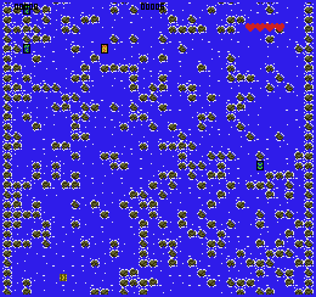

# Drift

Author: Jiasheng Zhou \<jiashen2@andrew.cmu.edu\>

Design: 

Screen Shot:

Asset Pipeline:

1. Authoring Tools: GIMP
2. Use GIMP to create 128px * 128px tile map in png format: tiles.png
3. Code that converts tiles.png to tiles.tile
4. Runtime code that loads tiles into memory and upload it to PPU466

How To Play:

(TODO: describe the controls and (if needed) goals/strategy.)

Sources: (TODO: list a source URL for any assets you did not create yourself. Make sure you have a license for the asset.)

This game was built with [NEST](NEST.md).

